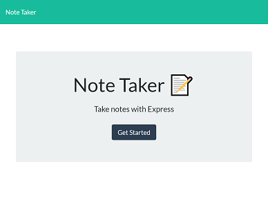
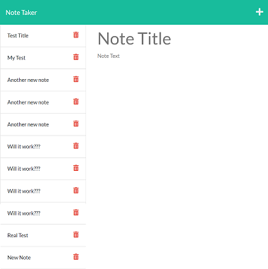

# note-taker

## Description
This application uses Express.js to allow a user to type a note and save it on a web page.

## Link to Live Page
[Live Link](https://roses-note-taker.herokuapp.com/)

## Screenshots

## License
This project is licensed under [ISC](https://opensource.org/licenses/ISC).